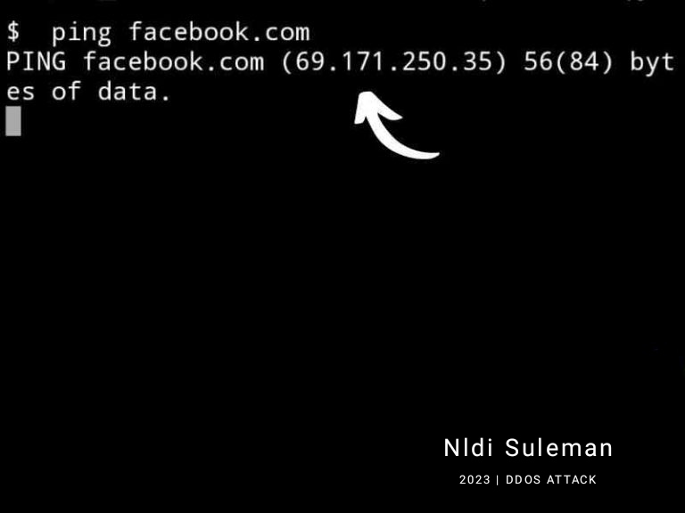

<!DOCTYPE html>
<html lang="en">
<head>
  <meta charset="UTF-8">
  <meta name="viewport" content="width=device-width, initial-scale=1.0">
  <meta http-equiv="X-UA-Compatible" content="ie=edge">
  <title>In Termux</title>
</head>
<body>

  <a href="https://www.facebook.com/naldi.suleman.0">Facebook</a>
  <a href="https://www.instagram.com/nldislmn">Instagram</a>

  
  
  
  
  

    

   <h1 style="color: #00FF7F;">TERMUX TUTORIAL</h1>
    
    
    
 
  

    
<footer>
  
&copy; 2023 Nldi Suleman. | All rights Reserved

</footer>

    
   <b>
Cara DDOS Menggunakan Termux
</b>
    
  

  
 
 
 
 

  <h1 style="color: #FFFFFF;">1. Install Script DDOS</h1>
  

  

  

  
Ada 6 script DDOS yang sudah terbukti ampuh untuk membuat sebuah website down, yaitu:
  

  
• Torshammer
 • Hammer
 • Xerxes
  • Hulk
 • LiteDDOS
 • LucitaDDOS

  
Pada tutorial ini saya menggunakan liteddos, karena penggunaannya cukup mudah.

  
Berikut adalah perintah termux untuk menginstal script liteddos.

  
$pkg install git python2  $git clone https ://github.com/4L13199/LITEDDOS

  
Untuk cara install script lain sudah saya cantumkan setelah tutorial ini.

  

  

  <h1 style="color: #FFFFFF;">2. Cari alamat IP dari website target</h1>
  

  

 

  
Setiap website pasti memiliki alamat IP, nah tugas kalian adalah mencarinya untuk melanjutkan proses DDOS.

  
Untuk menemukannya juga bisa menggunakan termux.

  
Caranya ketik ping alamat situs tanpa http/https.

  
Contoh: ping facebook.com

  
Kemudian salin alamat (angka) yang muncul.

   

    
    
    
           
    
  
ping IP termux

  
  <h1 style="color: #FFFFFF;">3. Serang website dari script DDOS</h1>
  

  
Untuk mulai menyerang website target, jalankan dulu script DDOS.

  
Karena script yang terinstal adalah liteddos, maka masukkan perintah berikut untuk menjalankannya

  
cd LITEDDOS

  
Kemudian masukkan lagi perintah ini.

  
python2 LITEDDOS.py ipTarget port jumlahPing

  
Keterangan:

  
– ipTarget ganti dengan alamat IP website 
– port isi saja 80 
– jumlahPing masukkan 100 atau lebih (semakin besar cepat down)

Contoh:

python2 LITEDDOS.py   69.171.250.35 80 100

Setelah ini akan terjadi proses DDOS dari termux, biarkan saja berlangsung sampai website target down.

proses ddos attack di termux

Saat proses berlangsung, sesekali cek website target apakah masih bisa diakses atau tidak.

Bagaimana kalau tidak down?

Ajak orang lain untuk menyerang dengan DDOS secara bersamaan. Karena semakin banyak, maka semakin sibuk server memproses serangan tersebut.

DDOS termux itu menggunakan koneksi internet. Jadi saat proses berlangsung, kuota internet kalian akan tersedot.

Nah, itu lah cara ddos menggunakan script liteddos. 

</body>
</html>
